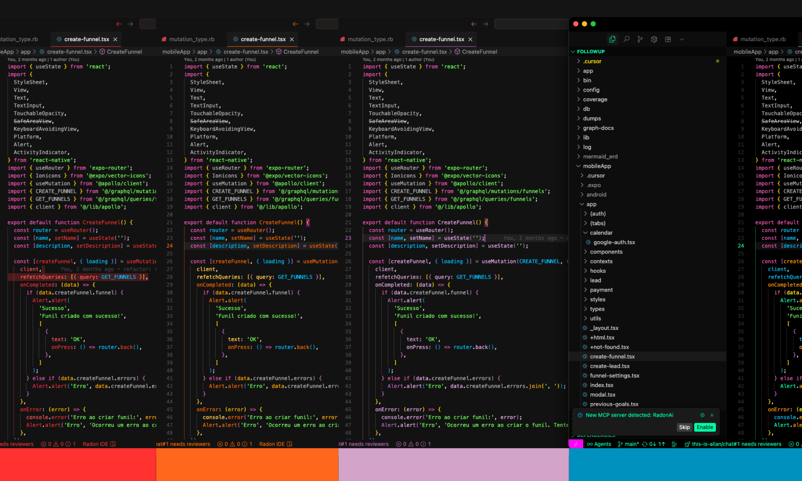

	

<h2 align="center">Night Rainbow</h2>

	

## ✨ Features

- Vibrant neon colors on a dark background
- Enhanced syntax highlighting for multiple programming languages
- Improved readability with carefully selected color combinations
- Consistent color scheme across the entire VS Code interface

## 🔍 Supported Languages

Night Rainbow provides enhanced syntax highlighting for:

- JavaScript/TypeScript
- HTML/CSS
- Python
- Java
- C/C++
- C#
- Go
- Rust
- Ruby
- PHP
- Swift
- Kotlin
- Dart
- GraphQL
- YAML/JSON
- Markdown
- SQL
- Shell scripts
- And many more!

## 🎈 Usage

1. Install the theme from the VS Code Marketplace
2. Go to `Preferences > Color Theme` (or `Ctrl+K Ctrl+T`)
3. Select "Night Rainbow" from the list
4. Enjoy coding with vibrant neon colors!

## ✍️ Authors

- [@allancarlos](https://www.linkedin.com/in/allancarlos/) - Creator of Night Rainbow

## 📝 License

This project is licensed under the MIT License.
